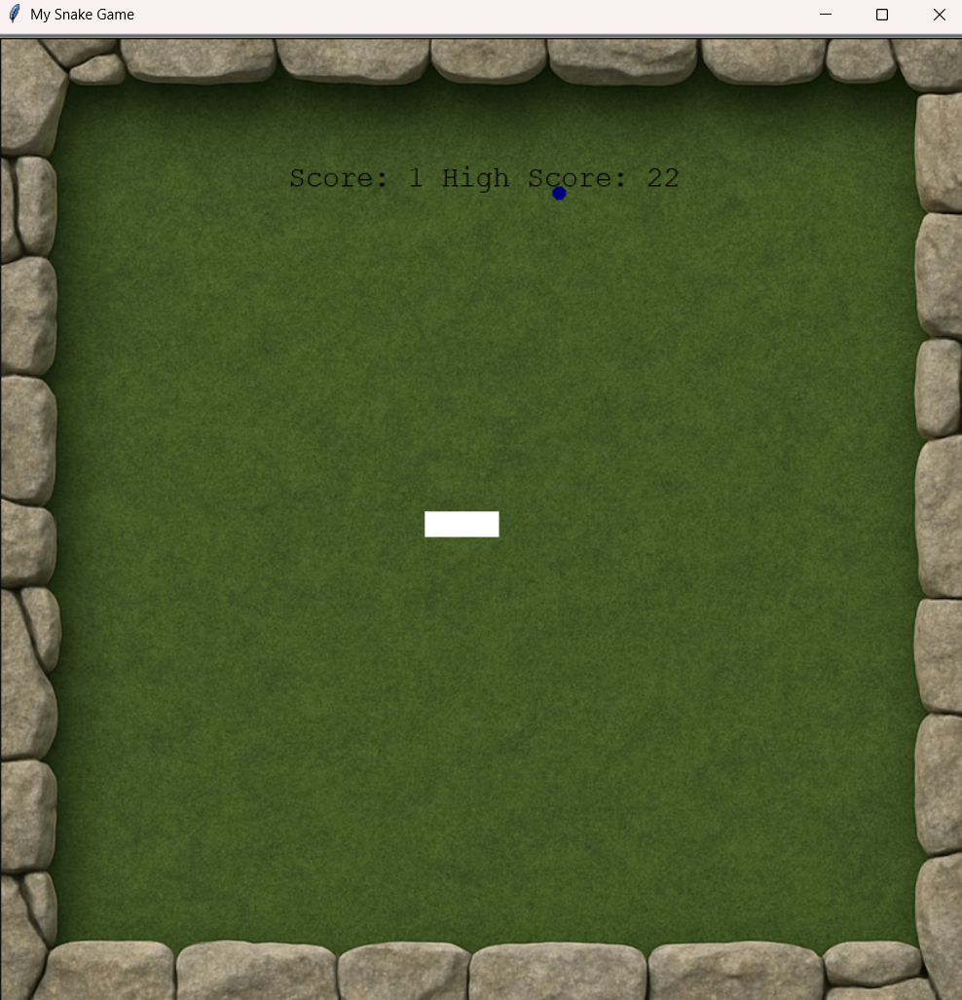

# 🐍 Snake Game – Python Turtle Edition

A classic Snake Game built using Python's Turtle graphics module with an object-oriented design approach.  
The game includes dynamic food spawning, score tracking, high-score persistence, and collision detection.

---

## 🎮 Features

- 🔄 Smooth snake movement using screen tracer optimization
- 🍎 Randomly spawning food with dynamic color changes
- 📈 Score tracking with persistent high score storage
- 💥 Collision detection:
  - Wall collision
  - Self collision
- ♻️ Automatic game reset after collision
- 🧱 Modular OOP structure (separate classes for Snake, Food, Scorecard)

---

## 🛠 Tech Stack

- Python 3
- Turtle Graphics Module
- File Handling (for high score persistence)
- Object-Oriented Programming (OOP)

---

## 📂 Project Structure

snake-game/
│
├── main.py
├── snake.py
├── FOOD.py
├── scorecard.py
├── highscore.txt
└── bg2.png

---

## ▶️ How to Run

1. Clone the repository:

2. Navigate to snake-game folder:

3. Run the game:

---

## 🎯 Controls

| Key | Action |
|------|--------|
| ↑ | Move Up |
| ↓ | Move Down |
| ← | Move Left |
| → | Move Right |

---

## 🧠 Concepts Applied

- Object-Oriented Programming
- Event Listeners & Key Bindings
- Collision Detection Logic
- File I/O Handling
- Game Loop Control
- Screen Rendering Optimization (`tracer()` and `update()`)

---

## 🚀 Future Improvements

- Add sound effects
- Add difficulty levels
- Add start screen & game over screen
- Add pause functionality
- Add obstacle mode
- Convert to Pygame for advanced rendering

---

## 📸 Screenshot

---
