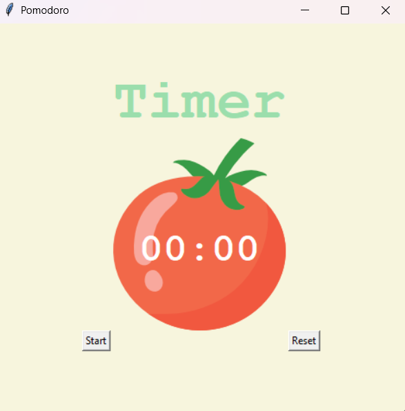

# ⏳ Pomodoro Timer – Tkinter Productivity App

A desktop Pomodoro Timer built using Python's Tkinter GUI framework.  
The application follows the Pomodoro Technique, automatically cycling between work sessions, short breaks, and long breaks.

---

## 🍅 Features

- ⏱ 25-minute work sessions (configurable)
- ☕ Automatic short break after each work session
- 🛌 Long break after every 4 work sessions
- ✔️ Visual progress tracking with checkmarks
- 🔁 Automatic session cycling
- 🧹 Reset functionality
- 🖼 Clean GUI with image integration

---

## 🛠 Tech Stack

- Python 3
- Tkinter (GUI Framework)
- Event-driven Programming
- `after()` scheduling for non-blocking countdown
- Mathematical time calculations

---

## 📂 Project Structure

pomodoro/
│
├── main.py
├── tomato.png
└── README.md

---

## ▶️ How to Run

1. Clone the repository:

2. Navigate to the pomodoro folder:

3. Run the application:

---

## 🧠 How It Works

- The application tracks repetitions using a global counter.
- Every odd repetition → Work Session
- Every even repetition → Short Break
- Every 8th repetition → Long Break
- The `window.after()` method ensures smooth countdown without freezing the GUI.

---

## 🎯 Concepts Applied

- GUI Layout Management (Grid system)
- Event-driven button handling
- Timer scheduling using Tkinter's event loop
- State management using global variables
- Conditional session switching logic
- Image embedding in GUI

---

## 🚀 Future Improvements

- Add sound notifications
- Add user-configurable timer duration
- Add pause functionality
- Add dark mode
- Add statistics tracking (daily focus time)
- Add task input field

---

## 📸 Screenshot

